# 训练细节与工程记录

本文档记录 RLRefine 各阶段训练的完整配置、资源消耗和关键观察，数据来源于实际训练日志。

---

## 1. 硬件与软件环境

| 项目 | 规格 |
|------|------|
| GPU | 2× NVIDIA H100 80GB HBM3 |
| 显存峰值 | SFT: 77.4 GiB / GRPO: 66.7 GiB |
| 分布式策略 | SFT: DDP / GRPO: DeepSpeed Zero2 |
| 框架 | ms-swift 3.11.2 |
| 推理加速 | vLLM 0.13.0 (GRPO 阶段 colocate 模式) |
| 精度 | bfloat16 |
| Python | 3.10 |

---

## 2. 训练数据统计

| 阶段 | 数据量 | 平均 Token 长度 | 数据来源 |
|------|--------|-----------------|----------|
| SFT | 3329 train + 369 val | 1996 ± 490 | Qwen3-Max 生成高质量示范 |
| DPO | ~3697 条偏好对 | -- | 同源数据 + chosen/rejected 对比 |
| GRPO | 同 SFT prompt 集 | -- | 仅保留 system + user（移除 assistant） |

数据拆分方式：SFT 阶段自动按 0.1 比例从训练集中拆出验证集。

---

## 3. 各阶段训练配置

### 3.1 SFT 阶段

| 参数 | 值 | 说明 |
|------|-----|------|
| 基座模型 | Qwen2.5-7B-Instruct | 7B 参数量指令微调模型 |
| 训练方式 | LoRA | 仅训练适配器参数 |
| LoRA Rank | 16 | -- |
| LoRA Alpha | 64 | alpha/rank = 4 |
| Target Modules | all-linear | q/k/v/o/gate/down/up_proj（7个模块） |
| LoRA Dropout | 0.05 | -- |
| Epochs | 5 | -- |
| Batch Size | 4 per device | 有效 batch = 4 × 2 GPU × 4 accum = 32 |
| Gradient Accumulation | 4 | -- |
| Learning Rate | 1e-5 | -- |
| Warmup Ratio | 0.05 | -- |
| Weight Decay | 0.1 | -- |
| Max Length | 8192 | 截断策略: delete |
| Adam Betas | (0.9, 0.95) | -- |
| Save Strategy | 每 100 steps | 保留最近 3 个 checkpoint |
| Early Stopping | eval_loss 无改善 3 次 | -- |

### 3.2 DPO 阶段

| 参数 | 值 | 说明 |
|------|-----|------|
| 输入模型 | SFT merged model | SFT checkpoint-500 合并后 |
| LoRA Rank | 8 | 比 SFT 更小，DPO 微调幅度更保守 |
| LoRA Alpha | 32 | alpha/rank = 4 |
| Beta (KL 惩罚) | 0.2 | DPO 标准值 |
| Learning Rate | 5e-7 | 比 SFT 小两个数量级 |
| Max Length | 4096 | -- |
| Epochs | 1 | DPO 通常只需 1 epoch |

### 3.3 GRPO 阶段

| 参数 | 值 | 说明 |
|------|-----|------|
| 输入模型 | DPO merged model | DPO checkpoint-220 合并后 |
| LoRA Rank | 8 | -- |
| LoRA Alpha | 16 | alpha/rank = 2 |
| Beta (KL 惩罚) | 0.01 | 远小于 DPO，允许更大的策略偏移 |
| Learning Rate | 5e-7 | -- |
| Temperature | 0.9 | 采样多样性 |
| Num Generations | 4 | 每个 prompt 生成 4 个候选 |
| Max Length | 4096 | -- |
| Max Completion Length | 2048 | 生成上限 |
| Batch Size | 2 per device | 有效 batch = 2 × 2 GPU × 4 accum = 16 |
| Gradient Accumulation | 4 | -- |
| DeepSpeed | Zero2 | 优化器状态分片 |
| vLLM Mode | colocate | 推理和训练共享 GPU |
| vLLM GPU Memory | 0.5 | 给 vLLM 分配 50% 显存 |
| Reward Function | json_keyword_reward | 自定义 Schema 驱动奖励 |
| Epochs | 1 | -- |

---

## 4. 训练结果

### 4.1 SFT 训练曲线

| Step | Train Loss | Eval Loss | Token Acc | 学习率 | 显存 (GiB) |
|------|-----------|-----------|-----------|--------|-----------|
| 20 | ~1.2 | -- | ~70% | 1e-5 | 76.3 |
| 100 | ~0.85 | ~0.72 | ~76% | 1e-5 | 76.3 |
| 200 | ~0.75 | ~0.71 | ~78% | 9.2e-6 | 76.3 |
| 300 | ~0.72 | ~0.70 | ~79% | 6.4e-6 | 76.3 |
| 400 | ~0.70 | ~0.70 | ~79% | 3.6e-6 | 76.3 |
| 460 | 0.687 | -- | 79.3% | 3.6e-7 | 76.3 |
| 500 (best) | 0.683 | 0.700 | 79.4% | 4e-8 | 76.3 |
| 520 (final) | 0.697 | 0.700 | 79.0% | 0 | 77.4 |

**关键观察**：
- Loss 在 epoch 2-3 快速下降后趋于平稳
- Eval loss 和 Train loss 差距很小（0.70 vs 0.68），未出现明显过拟合
- Token accuracy 稳定在 79%，说明模型对推理 + JSON 格式的生成已掌握
- Best checkpoint 在 step 500，训练结束时 loss 略有回升

### 4.2 GRPO 训练指标

| 指标 | 最终值 | 说明 |
|------|--------|------|
| Reward (mean) | 0.9375 | 接近满分，模型已充分优化 |
| Reward (std) | 0.125 | 低方差，输出高度一致 |
| Train Loss | 3.37e-05 | 极低，策略梯度已收敛 |
| KL Divergence | 0.00045 | 极低，模型几乎未偏离参考策略 |
| frac_reward_zero_std | 0.75 | 75% batch 内所有生成获得相同奖励 |
| Completion Mean Length | 999 tokens | 输出长度稳定 |
| Clip Ratio (high) | 0.001 | 极少触发裁剪 |

**关键观察**：
- KL 极低说明 GRPO 在 DPO 已经对齐的基础上只做了微小调整
- `frac_reward_zero_std = 0.75` 暗示可能的奖励饱和（详见 [reward_design.md](reward_design.md)）
- 训练全程未出现 reward collapse 或 KL 爆炸

---

## 5. 训练时长与资源消耗

| 阶段 | 总步数 | 训练时长 | 每步耗时 | 训练速度 |
|------|--------|----------|----------|----------|
| SFT | 520 | ~1h 9min | ~7.9s | 0.127 iter/s |
| GRPO | 924 | ~4h 35min | ~17.9s | 0.056 iter/s |

GRPO 每步耗时约为 SFT 的 2.3 倍，主要原因：
- 每步需要 vLLM 生成 4 个 completion（推理开销）
- DeepSpeed Zero2 通信开销
- 奖励函数计算（JSON 解析、F1 计算、幻觉检测）

---

## 6. Checkpoint 选择策略

| 阶段 | 策略 | 选择的 checkpoint |
|------|------|-------------------|
| SFT | 基于 eval_loss 最小 | step 500 (eval_loss=0.700) |
| DPO | 基于 eval_loss 最小 | step 220 |
| GRPO | 取最后一个 | step 924 (last) |

GRPO 取 last 而非 best 的原因：
- GRPO 训练中 reward 持续上升且未出现下降
- 没有设置单独的验证集（split_dataset_ratio=0）
- KL 保持极低，不存在过度偏离的风险

---

## 7. 工程问题与解决方案

### 7.1 vLLM Colocate 模式显存管理

**问题**：GRPO 需要同时运行训练和 vLLM 推理，显存竞争严重。

**解决方案**：
- 设置 `vllm_gpu_memory_utilization=0.5`，给 vLLM 分配一半显存
- GRPO 阶段 LoRA rank 从 16 降到 8，减少训练侧显存占用
- 使用 DeepSpeed Zero2 分片优化器状态

### 7.2 LoRA 融合流程

每个阶段训练结束后需要将 LoRA 权重合并到基座模型：

```bash
bash rl/merge_lora.sh
```

融合后模型作为下一阶段的输入。这保证了 DPO/GRPO 阶段能直接在强化后的模型上继续训练，而非叠加多层 LoRA。

### 7.3 数据格式转换

SFT → GRPO 的数据格式转换需要：
- 移除 assistant 回复（GRPO 让模型自己生成）
- 保留 system + user prompt
- 可选添加 `<think>` 标签提示

使用 `rl/convert_sft_to_grpo.py` 自动完成。

---

## 8. 训练曲线

### 8.1 SFT 阶段

**Train Loss**

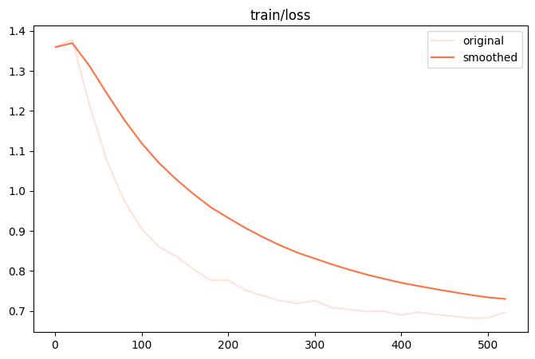

Train loss 从 ~1.37 快速下降，在 200 steps 后趋于平稳，最终收敛至 ~0.7。

**Eval Loss**

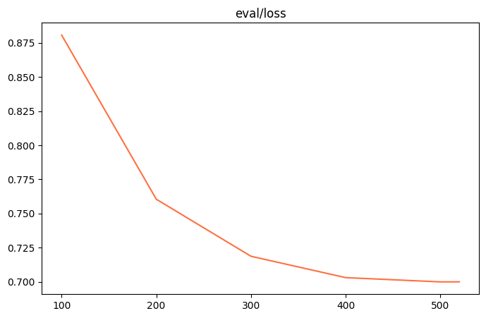

Eval loss 从 0.88 持续下降至 0.70，与 train loss 差距小，未出现明显过拟合。

**Token Accuracy**

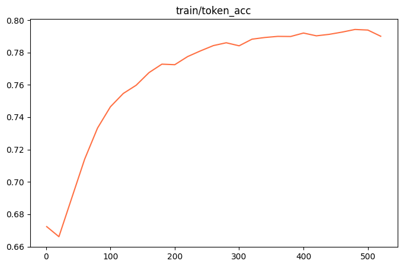

Token accuracy 从 67% 稳步提升至 79%，说明模型对推理 + JSON 格式的生成已掌握。

**Learning Rate**

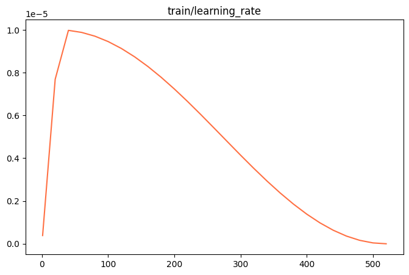

### 8.2 DPO 阶段

**Train Loss**

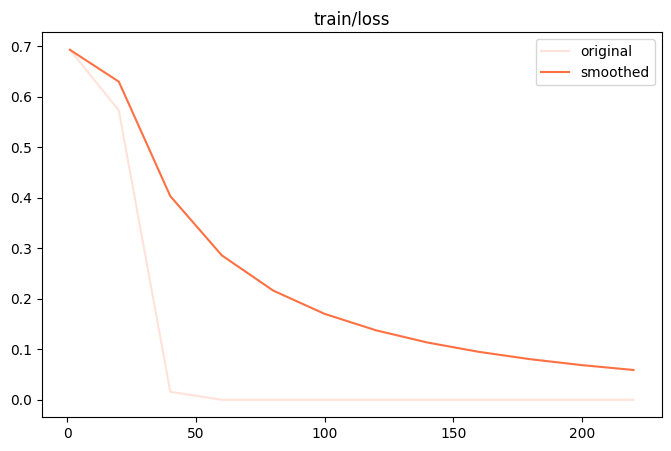

DPO loss 从 ~0.7 快速下降至接近 0，说明模型很快学会区分 chosen/rejected 对。

**Eval Rewards Accuracy**

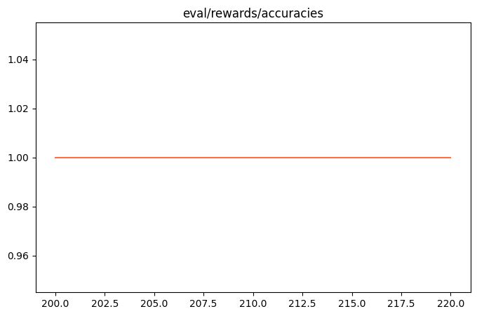

验证集上 reward accuracy 稳定在 1.0，模型对偏好判断已完全对齐。

**Eval Rewards Margins**

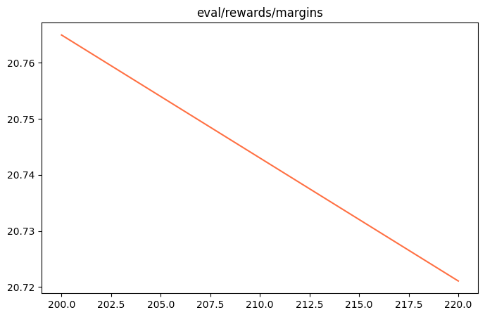

### 8.3 GRPO 阶段

**Reward**

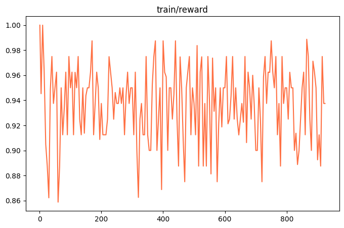

Reward 在训练初期即达到较高水平（0.88-1.0），全程在 0.86-1.0 区间内波动，均值约 0.94。

**Train Loss（策略梯度 Loss）**

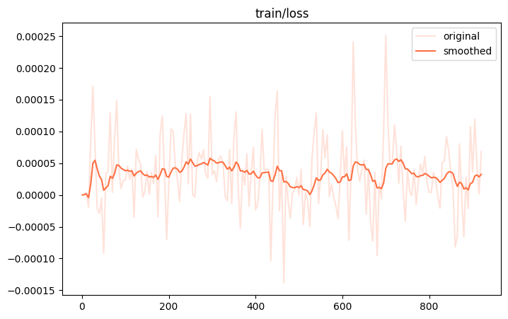

GRPO loss 极小（量级 1e-4），围绕 0 附近波动，说明策略梯度已收敛。

**KL Divergence**

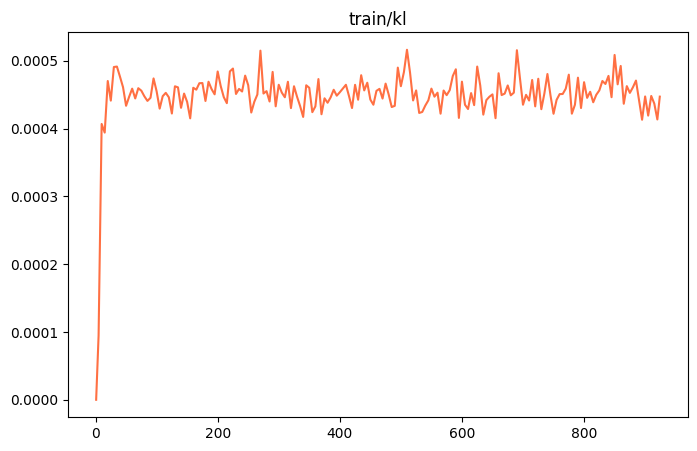

KL 散度在前 50 steps 内迅速上升至 ~0.00045 后保持稳定，说明模型只做了极小的策略偏移。

**frac_reward_zero_std**

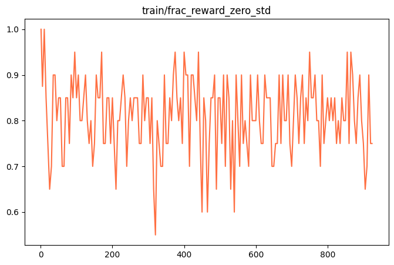

该指标在 0.65-1.0 之间波动，均值约 0.75——表示 75% 的 batch 内所有生成获得相同奖励（详见 [reward_design.md](reward_design.md) 中的 Reward Hacking 分析）。

**Completions Mean Length**

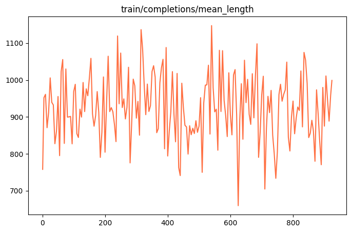
